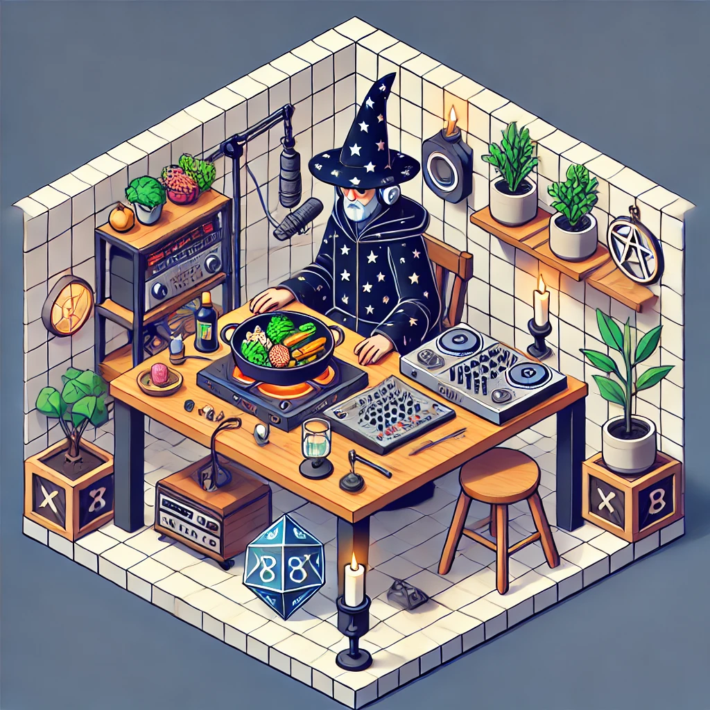

# Podcast Potion Gourmet - XP na Cozinha

Um podcast criado com auxilio de Inteligencia Artificial, desenvolvido durante o BootCamp CAIXA - IA Generativa com Microsoft Copilot. 

🎙️ Ouça o Podcast: [Output/Podcast_editado.MP3](https://github.com/LopesD92/Podcast-Potion-Gourmet---XP-na-cozinha---Projeto-de-IA/blob/main/output/Podcast%20Potion-Gourmet%20-%20Level%201.mp3)

# 💻 Tecnologias utilizadas no projeto

- [ChatGPT](https://chatgpt.com/) para geração de roteiro e conteudo.
- [Criador de Imagens BING](https://www.bing.com/images/create?FORM=GDPCLS) para geração da imagem.
- [DALL 3 Ultra - ChatGPT](https://chatgpt.com/g/g-T0cSa59Fg-dall-3-ultra) para geração da imagem.
- [ElevenLabs](https://elevenlabs.io/app/home) para gerar o audio atraves de Text-To-Speech.
- [CapCut](https://www.capcut.com/pt-br/) para edição de audio.

# 🧠 Prompts utilizados

**ChatGPT**
| Ação | Promtp |
|------|--------|
|Criar Título do Podcast| Você é um roteirista de podcast, e vamos criar um podcast de culinária geek, focado em receitas que podem ser criadas na cozinha e que possam ser proveniente da cultura geek e do universo dos animes, games e mangás. Eu gostaria de uma ajuda sua para criar 5 sugestões de nomes criativos para um podcast de culinaria feito por nerds, e que tenha algum trocadilho que remeta a esse universo geek, anime e dos games. O podcast vai falar sobre receitas e curiosidades sobre o mundo da culinária, que envolva o universo geek e dará dicas para manter uma alimentação balanceada e saudável. {REGRAS} - O nome deve ser enxuto, um nome e um subtítulo - O nome tenha algum trocadilho nerd e de culinária, e também o universo dos animes, mangás e games. - O nome deve conter alguma palavra forte que remeta ao universo geek |
|Criar Roteiro do Podcast|Você é um roteirista de podcast, e vamos criar um  roteiro de um podcast de tecnologia, focado em frontend cujo o nome é "Potion Gourmet - XP na Cozinha" e tem foco em culinária e hábitos saudáveis de alimentação, com o público alvo de amantes da cultura GEEK, animes e games. o formato do roteiro deve ser [INTRODUÇÃO] [CURIOSIDADE 1] [CURIOSIDADE 2] [FINALIZAÇÃO] {REGRAS}- no bloco [INTRODUÇÃO] substitua por uma introdução iguais as introduções dos vídeos do canal 'ei nerd', como se fossem escritos pelo Peter Jordan - no bloco [CURIOSIDADE 1] substitua uma dica de receita facil para começar na cozinha - no bloco [CURIOSIDADE 2] sobre dicas de alimentos saudáveis para manter a forma  - no bloco [FINALIZAÇÃO] substitua por uma despedida cool com o final 'Me chamo Lopes.D, o mago dos sabores, e o Potion Gourmet dessa semana esta chegando ao fim, muito obrigado pela atenção. Tamo junto!' - use termos de fácil explicação - O podcast vai ser apresentado somente por uma pessoa, chamada Lopes.D  - O podcast deve ser curto {REGRAS NEGATIVAS}- Não use muitos termos técnicos - Não ultrapasse 5 minutos de duração|

**DALL 3 Ultra - ChatGPT**
| Ação | Prompt |
|------|--------|
| Criar imagem | create an image of a wizard as a cooking podcaster from the geek and anime universe, with microphone , isometric, cube, game style, Medium resolution  --ar 1:1 --v 5.2|
| Mesclar imagem | Recrie utilizando a imagem anexada como inspiração |

**Criador de Imagens IA BING**
| Ação | Prompt |
|------|--------|
| Criar imagem | create an image of a wizard as a cooking podcaster from the geek and anime universe, with microphone , isometric, cube, game style, Medium resolution  --ar 1:1 --v 5.2|

## 👨‍💻 Autoria

    
Daniel Lopes  
[GitHub](https://github.com/LopesD92) 
    

---

⌨️ com 💜 e :coffee: por [Daniel Lopes](https://github.com/LopesD92) 
